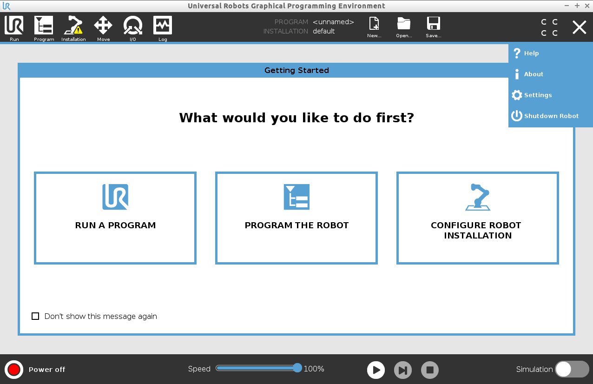
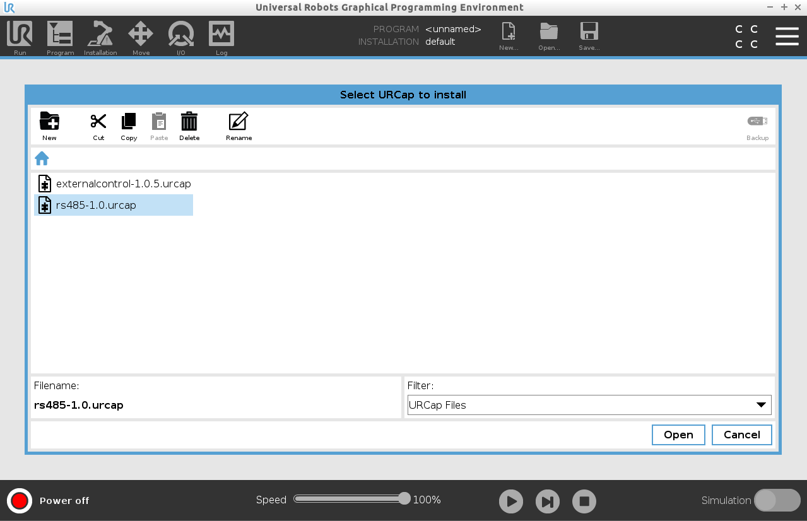
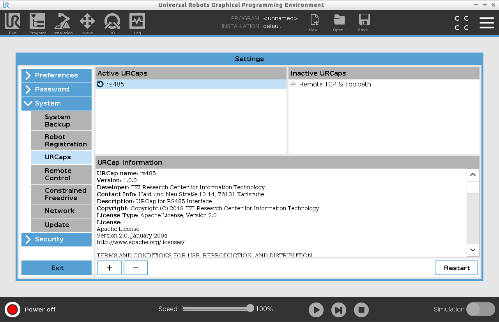
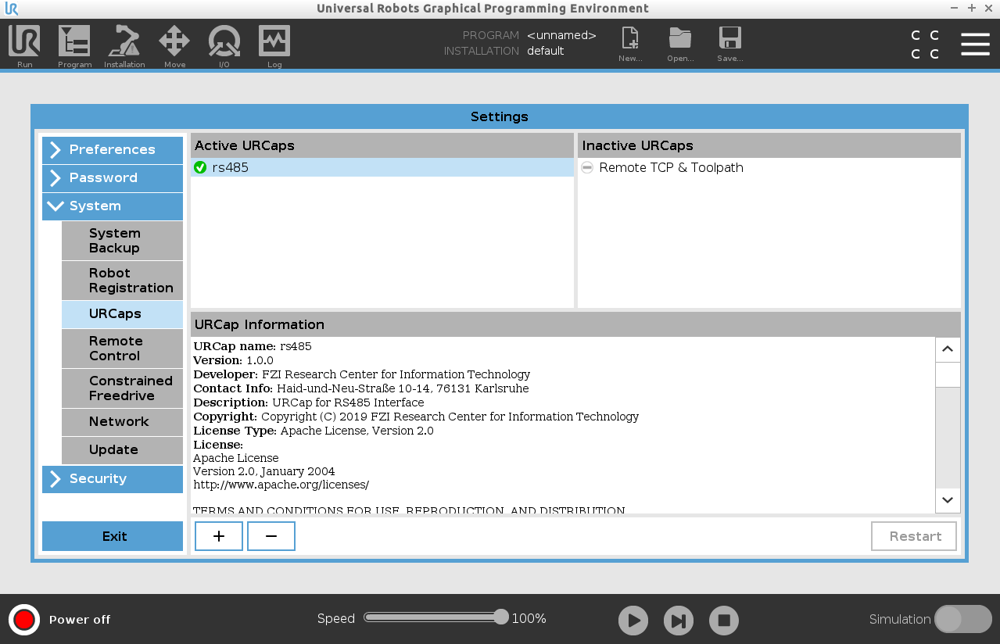
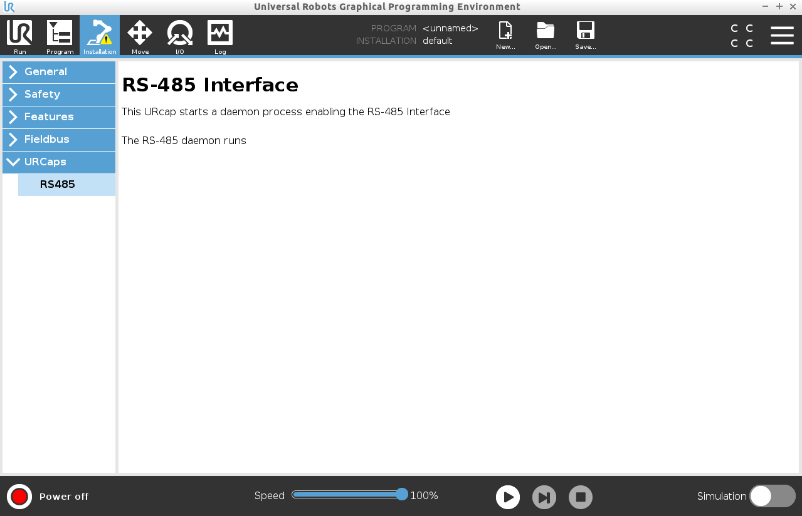

# How to install the RS485 URCap

This is a short step-by-step guide how to install the RS485 URCap in Polyscope.
We assume that you copied the latest *RS485 URCap* from [here](https://github.com/UniversalRobots/Universal_Robots_ToolComm_Forwarder_URCap/releases) to the `programs` folder of your e-series robot.

## Add the URCap to the system
After startup of the robot, click on the `hamburger` menu item at the top right of
the screen and select `Settings`.

In the menu on the left, go down to `System` -> `URCaps` and click the `+` button to add a URCap to the system.
Choose the RS485 URCap file you previously copied to the robot's `programs` folder and open it.

Your display should show the `rs485` under `Active URCaps`.

You now need to restart Polyscope for the changes to take effect.

## Confirm the installation
After restarting and coming back to this page, you should see the `rs485` URCap marked with a green check.

Finally, under the `Installation` tab, confirm that the RS-485 daemon runs.

